<div align="center">

# 👋 Hello, I'm Asel Inuke Hidallearachchi

<div align="center">
  
</div>

### 🚀 Passionate Software Engineer | AI Enthusiast | Problem Solver

<p align="center">
  <a href="mailto:your-email@example.com"></a>
  <a href="https://linkedin.com/in/your-profile"></a>
  <a href="https://twitter.com/your-handle"></a>
  <a href="https://your-portfolio.com"></a>
</p>

---

## 🧠 About Me

```javascript
const developer = {
    name: "Asel Inuke Hidallearachchi",
    role: "Full Stack Developer & AI Engineer",
    location: "Sri Lanka 🇱🇰",
    education: "Computer Science Student",
    
    currentFocus: ["AI/ML Projects", "Full Stack Development", "Mobile Development"],
    technologies: ["React", "Node.js", "Python", "Swift", "Java"],
    interests: ["Machine Learning", "Web Development", "Mobile Apps", "Open Source"],
    
    motto: "Building the future, one commit at a time 🚀"
};
```

</div>

## 🛠️ Technology Stack

<div align="center">

### 🎯 Core Technologies


### ⚛️ Frontend & Mobile


### 🔧 Backend & Database


### 🤖 AI/ML & Data Science


### 🛠️ Tools & DevOps


</div>

## 🌟 Featured Projects

<div align="center">

### 🎯 AI & Machine Learning

</div>

<table>
<tr>
<td width="50%">

#### 🧠 UltraDiffusion - AI Medical Imaging
**Final Year Project | 2025**

Advanced ultrasound image denoising using Stable Diffusion models and deep learning techniques.

**🚀 Tech Stack:**
- Python, PyTorch, Diffusers
- React, TypeScript, Tailwind CSS
- Flask API, Computer Vision
- Hugging Face Transformers

**✨ Key Features:**
- Real-time image enhancement
- Stable Diffusion fine-tuning
- Medical-grade denoising
- Interactive web interface

[🔗 View Project](https://github.com/AselInukeHidallearachchi/FYP-IIT-UltraDiffusion)

</td>
<td width="50%">

#### 📊 Profit Prediction System
**Machine Learning | 2023**

Predictive analytics system for business profit forecasting using advanced ML algorithms.

**🚀 Tech Stack:**
- Python, Jupyter Notebook
- Pandas, NumPy, Scikit-learn
- Data Visualization
- Statistical Modeling

**✨ Key Features:**
- Multiple regression models
- Data preprocessing pipeline
- Performance metrics analysis
- Interactive visualizations

[🔗 View Project](https://github.com/AselInukeHidallearachchi/profit-prediction)

</td>
</tr>
</table>

<div align="center">

### 💻 Full Stack Development

</div>

<table>
<tr>
<td width="50%">

#### 🌐 DevHub - Developer Social Network
**MERN Stack | 2024**

A comprehensive social platform for developers with profiles, posts, and networking features.

**🚀 Tech Stack:**
- React, Redux, Node.js, Express
- MongoDB, JWT Authentication
- Tailwind CSS, Axios
- GitHub API Integration

**✨ Key Features:**
- User profiles & portfolios
- Social posting system
- Real-time interactions
- Developer networking

[🔗 View Project](https://github.com/AselInukeHidallearachchi/DevHub)

</td>
<td width="50%">

#### 🍕 Deliveroo Clone
**React Native | 2024**

Full-featured food delivery app with restaurant browsing, ordering, and payment integration.

**🚀 Tech Stack:**
- React Native, JavaScript
- Redux for state management
- Restaurant menu system
- Mobile UI/UX design

**✨ Key Features:**
- Restaurant discovery
- Menu browsing & ordering
- Cart management
- User-friendly interface

[🔗 View Project](https://github.com/AselInukeHidallearachchi/Deliveroo-clone)

</td>
</tr>
</table>

<div align="center">

### 📱 Mobile & Desktop Applications

</div>

<table>
<tr>
<td width="50%">

#### 📱 iOS Development Projects
**Swift | 2024-2025**

Native iOS applications showcasing modern Swift development practices and iOS design patterns.

**🚀 Tech Stack:**
- Swift, SwiftUI
- iOS SDK, Xcode
- Core Data, UIKit
- iOS Design Guidelines

**✨ Key Features:**
- Native iOS performance
- Modern UI/UX design
- iOS best practices
- Device optimization

[🔗 View Projects](https://github.com/AselInukeHidallearachchi/IOS_CW)

</td>
<td width="50%">

#### 🏥 Skin Consultation Manager
**Java Application | 2023**

Desktop application for managing skin consultations with appointment scheduling and patient records.

**🚀 Tech Stack:**
- Java, Swing GUI
- Object-Oriented Design
- File I/O Management
- Desktop Application

**✨ Key Features:**
- Patient management system
- Appointment scheduling
- Medical records tracking
- User-friendly interface

[🔗 View Project](https://github.com/AselInukeHidallearachchi/SkinConsultationManager)

</td>
</tr>
</table>

## 📈 GitHub Analytics

<div align="center">


</div>

<div align="center">

[](https://git.io/streak-stats)

</div>

## 🏆 GitHub Trophies

<div align="center">

[](https://github.com/ryo-ma/github-profile-trophy)

</div>

## 💡 Current Focus & Goals

```mermaid
graph TD
    A[🎯 Current Focus] --> B[AI/ML Projects]
    A --> C[Full Stack Development]
    A --> D[Mobile Development]
    
    B --> E[Computer Vision]
    B --> F[Deep Learning]
    B --> G[Medical AI]
    
    C --> H[MERN Stack]
    C --> I[TypeScript]
    C --> J[Cloud Deployment]
    
    D --> K[iOS Development]
    D --> L[React Native]
    D --> M[Cross-Platform]
```



### 🌱 Currently Learning
- Advanced Machine Learning techniques
- Cloud Computing (AWS, Azure)
- DevOps practices and CI/CD
- Advanced iOS development with SwiftUI
- Microservices architecture

### 👯 Looking to Collaborate On
- Open source AI/ML projects
- Full-stack web applications
- Mobile app development
- Healthcare technology solutions
- Educational technology platforms

## 📊 Activity Graph

<div align="center">

[](https://github.com/ashutosh00710/github-readme-activity-graph)

</div>

## 💬 Let's Connect!

<div align="center">

### 🤝 Open for collaborations, discussions, and opportunities!

**📧 Email:** your-email@example.com  
**💼 LinkedIn:** [Connect with me](https://linkedin.com/in/your-profile)  
**🐦 Twitter:** [Follow me](https://twitter.com/your-handle)  
**🌐 Portfolio:** [View my work](https://your-portfolio.com)

---

<p align="center">
  
</p>

<p align="center">
  <i>⚡ "Code is like humor. When you have to explain it, it's bad." - Cory House</i>
</p>

<p align="center">
  <i>🚀 Always ready to take on new challenges and build amazing things!</i>
</p>

</div>

---

<div align="center">
  <b>Happy Coding! 👨‍💻✨</b>
</div>